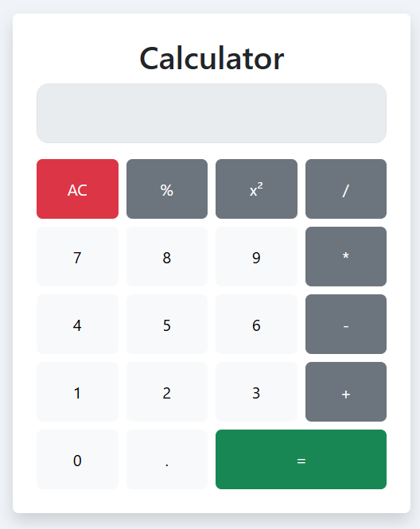

# 🧮 Smart Calculator

A responsive and functional Calculator built using **HTML**, **CSS (Flexbox & Bootstrap)**, and **JavaScript**.



This calculator supports both basic and extended operations:

- Addition (+)
- Subtraction (−)
- Multiplication (×)
- Division (÷)
- Modulo (%)
- Square of a number (x²)
- All Clear (AC) and Equal (=) buttons

## 🚀 Live Demo

👉 [smartcalculator1.netlify.app](https://smartcalculator1.netlify.app/)

## 🛠 Technologies Used

- HTML5
- CSS3 (Flexbox + Bootstrap)
- JavaScript (Event listeners, functions, conditionals, DOM manipulation)

## 📂 Project Structure

```
📁 Smart Calculator
├── index.html
├── style.css
└── script.js
```

## ✅ Features

- Real-time calculations
- Supports decimals and whole numbers
- Clear interface and design
- Responsive layout using Bootstrap

## 🧠 Learning Outcomes

- DOM manipulation using JavaScript
- Creating interactive UI with CSS and Bootstrap
- Writing clean code with comments

## 📝 License

This project is licensed under the [MIT License](LICENSE).
